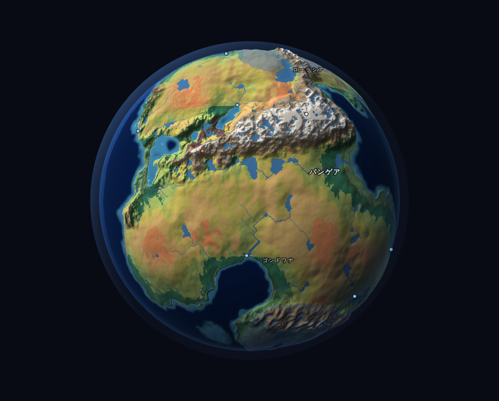
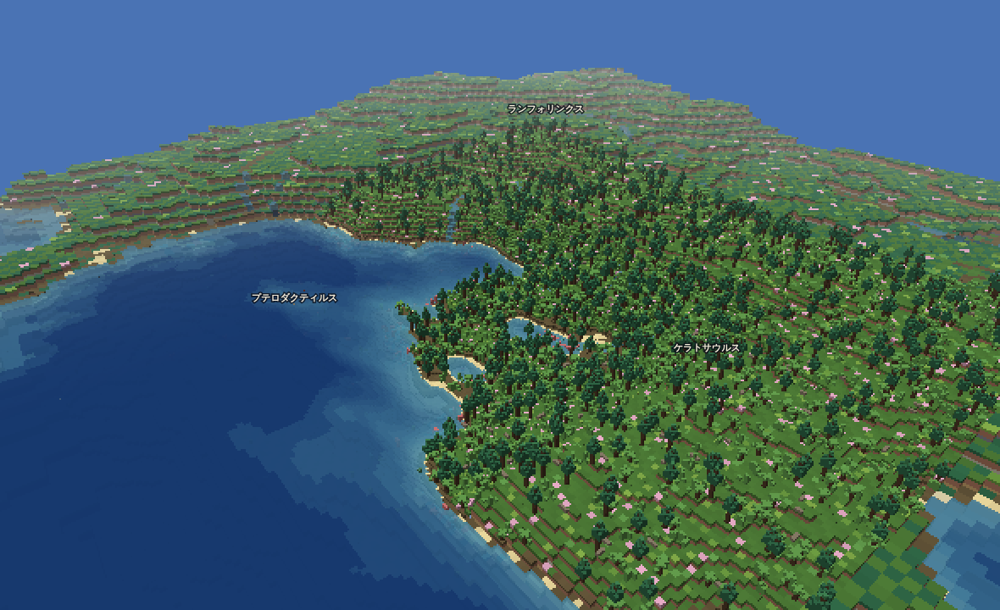
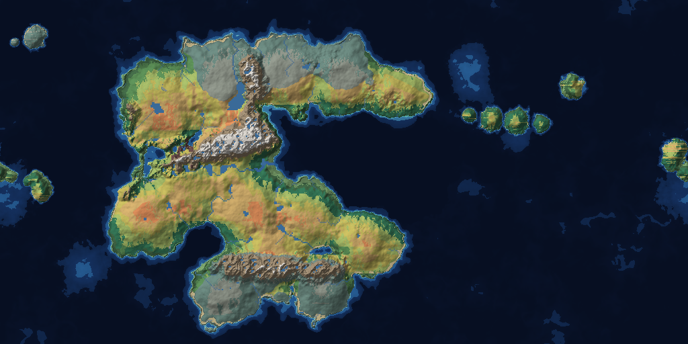
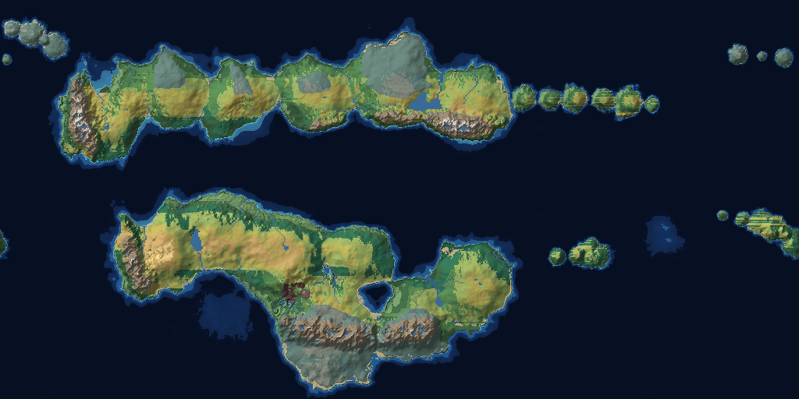
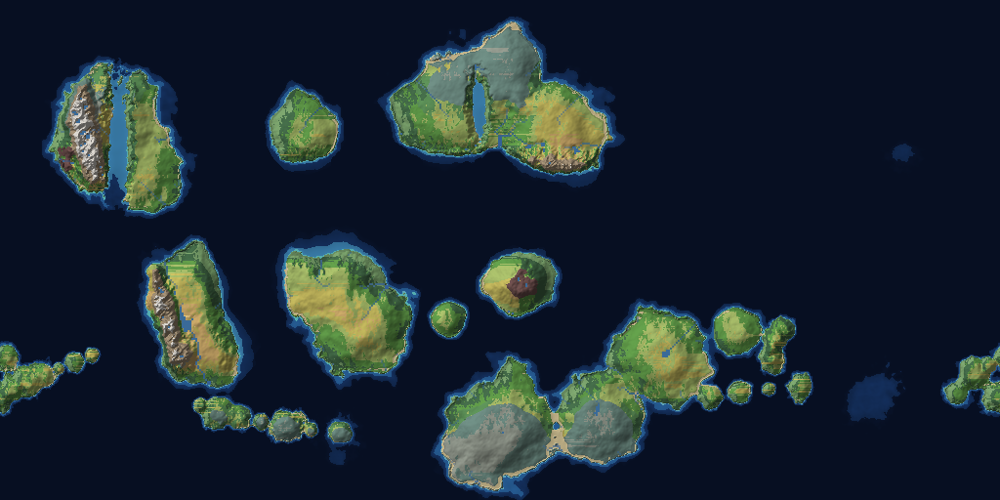
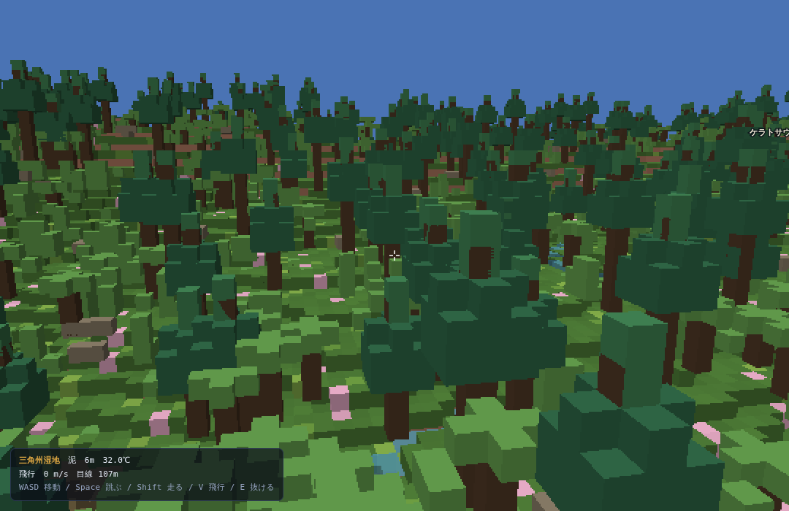

# 中生代ワールドマップ — Mesozoic Atlas

中生代（三畳紀・ジュラ紀・白亜紀）の広大なワールドマップを手続き的に生成する、
依存パッケージなしのブラウザアプリです。実際の古地理復元をもとにした大陸配置に、
気候モデルと水文モデルを重ねて、紀ごとにまったく違う世界を作り出します。

三つの紀は一本の**年代軸**につながっています。大陸核には紀をまたいで同じプレートを
指す id が付いていて、2億5000万年前から7000万年前までの任意の年代で、
プレートの位置を補間した古地理を生成できます。スライダーを動かせば大陸が移動し、
海が開き、山脈が隆起していきます。それを **2D 地図**・**3D 地球儀**・
**地表のボクセル（3D ピクセル）**の三通りで見られます。



地図の上から見るだけでなく、**世界の一区画に降りて**、1 ブロック 6m の縮尺で歩けます。
下は 1億6000万年前・ジュラ紀の河口。地図が持っているのは「ここは三角州湿地」という
20km セル 1 個ぶんの情報だけで、汀線も水系も森も、その場で作り足しています。



| 三畳紀 230Ma | ジュラ紀 160Ma | 白亜紀 90Ma |
| --- | --- | --- |
|  |  |  |

## 動かす

### いちばん簡単 — HTML を 1 枚ダブルクリックする

**`dist/mesozoic-atlas.html` は全部入りの単一ファイルです。サーバも Node も要りません。**
ダウンロードしてダブルクリックすれば、地図も地球儀も探索モードもそのまま動きます。

ふつう ES モジュールは `file://` から読み込めません（ブラウザが CORS で拒む）が、
この版は全モジュールを HTML の中に畳んであるので制約を受けません。
Service Worker の登録も `http` のときだけ走るようにしてあります。

### 開発するとき — HTTP で配信する

`src/` をそのまま読む版は ES モジュールなので配信が要ります。
サーバは Node だけで動きます（依存パッケージ・python どちらも不要）。

```bash
npm start          # http://localhost:8080 で配信
npm run dev        # 配信してブラウザも開く
npm run bundle     # dist/mesozoic-atlas.html を作り直す
npm test           # 生成器・区画・当たり判定の検証
npm run uitest     # ブラウザでの操作（スマホ／PC）の検証
```

### アプリとして入れる

PWA なので、ブラウザのアドレスバーの「インストール」からアプリとして入れられます。
入れると独立したウィンドウで開き、Service Worker が本体をキャッシュするので
**二回目からはオフラインでも動きます**（世界はその場で生成するので、通信は要りません）。

キャッシュは network-first です。つながっていれば必ず最新を取りに行くので、
`src/` を書き換えながら開発しても古い版が居座りません。

### 操作

| 操作 | 内容 |
| --- | --- |
| ドラッグ | 2D は地図を移動（経度は無限ループ）、3D と地表は視点を回転 |
| ホイール | ズーム |
| クリック | その地点を調査（気候・バイオーム・そこに棲む生物）。どの表示でも同じ |
| 年代スライダー | 2億5000万〜7000万年前を連続で移動。離した時点でその年代の世界を生成 |
| <kbd>1</kbd> <kbd>2</kbd> <kbd>3</kbd> | 三畳紀 / ジュラ紀 / 白亜紀 |
| <kbd>G</kbd> | 2D 地図 → 3D 地球儀 → ピクセル地表 と切替 ・ <kbd>Space</kbd> 自転 |
| <kbd>W</kbd><kbd>A</kbd><kbd>S</kbd><kbd>D</kbd> | 地表の視点を動かす ・ <kbd>N</kbd> 別の場所へ降りる |
| <kbd>E</kbd> | 探索モード（一人称）に出入りする |
| <kbd>R</kbd> | 再生成 ・ <kbd>L</kbd> 地名 ・ <kbd>F</kbd> 視点リセット |

探索モード中は <kbd>W</kbd><kbd>A</kbd><kbd>S</kbd><kbd>D</kbd> で歩き、
<kbd>Space</kbd> で跳び、<kbd>Shift</kbd> で走り、<kbd>V</kbd> で飛行に切り替えます。
画面をクリックするとマウスで視線を回せます（<kbd>Esc</kbd> で解除。
ポインタロックが使えない環境ではドラッグで首を振れます）。

2D 地図や 3D 地球儀で地点を調べると、その場所へ降りるボタンが出ます。

シードを変えれば同じ紀でも別の世界になり、同じシードなら何度でも同じ世界が再現されます。
解像度は 1024×512 から 4096×2048（1 セルあたり 10 km）まで選べます。

#### スマホ

- 右上の **設定** で操作パネルを開閉する。畳むと地図が全画面になる
- 二本指でピンチすると拡大・縮小（地図・地球儀・地表のどれでも）
- 探索モードでは **画面の左下に触れた所**にスティックが出る（定位置ではないので、
  指を見ずに置ける）。**右半分をなぞると視線が動く**ので、歩きながら振り向ける。
  右下は **跳/走/飛/出**。探索に入るときは設定が自動で畳まれる
- 視点の速さは「地表の区画」の *視点の速さ* で変えられる
- 視点の上下は既定で反転（指で世界を掴んで動かす向き）。
  「表示」の *視点の上下を反転* で戻せる。設定は端末に憶える

## 3D 地球儀

2D 地図と同じラスタをテクスチャに使い、標高で球面を変位させた WebGL の地球儀です。
海面は半径 1.0 の半透明シェルとして別に描いているので、**大陸棚や内陸海路では
水の下に海底地形が透けて見え**、深海では不透明な水になります。
地名と名所は球面座標から画面へ投影して 2D で重ね、縁に近いものほど小さく薄く描きます。

WebGL2 があれば使い、無ければ WebGL1 + `OES_element_index_uint` に落とします。

## 地表ボクセル（3D ピクセル）

マップの 1 セルは約 20 km あります。そこに降りて 1 ブロック 6m の縮尺で見るビューでは、
**マップから借りるのは標高・気温・湿潤度・大陸性・火山活動だけ**で、
残りはその場で作ります。

- **地形** — マップの傾斜と高度から起伏の大きさを決め、多重ノイズで刻む。
  山地だけ稜線ノイズを乗せるので、平野に地図と無関係な峰は生えない
- **水系** — 区画のなかで窪地埋め → 流向 → 流量集積を回して河川と湖を作る。
  浅い窪地は堆積で埋め、水が集まる窪地だけを湖にする（でないと山が水没する）
- **環境** — 尾根は高地、谷底は沼、汀は砂浜。マップと同じ `classify()` に
  その場の標高・気温・湿潤度を通して引き直す。水域だけは実水深（m）で判定する
- **地層** — 崖の縞は高度だけの関数。列ごとにずらすと横につながらず、ただのノイズになる
- **植生と動物** — 紀とバイオームに合う樹形（ナンヨウスギ・木性シダ・ソテツ・被子植物）を
  置き、`fauna.js` に載っている種のうちその環境に棲むものを歩かせる

広さは 2.3〜4.6 km 四方、ドットの粗さは 4 段階。遠景は 2 倍・4 倍のブロックにまとめ、
草木を置かない距離では地面そのものを樹冠の色で塗って森に見せています。

## 探索モードとゲームへの転用



地表ボクセルには一人称の**探索モード**があります。重力・段差の乗り越え・
遊泳・飛行があり、幹と岩は壁として止まります（当たり判定は柱の高さマップ
1 枚だけで済ませているので、4.6km 四方でも軽い）。目線は 2 ブロック＝12m、
つまり**大型恐竜の視点**です。1 ブロック 6m の世界を人間サイズで歩くと、
何も動いて見えないためです。

この部分は UI から切り離して `src/game/` にあり、そこだけを import すれば
別のゲームに持っていけます。

```js
import { createGameWorld, enterScene, findSpawn } from './src/game/api.js';
import { Explorer } from './src/game/player.js';

const game  = await createGameWorld({ seed: 'pangaea', ma: 160 });
const scene = await enterScene(game, null, { size: 'large' });
const you   = new Explorer(scene, findSpawn(scene));
const view  = you.update(1 / 60);     // → { eye:[x,y,z], yaw, pitch }
```

区画は他のエンジンにも書き出せます。

```bash
node tools/export-scene.mjs --seed pangaea --ma 90 --scene large --out out/
#   out/90Ma-...json         高さ・水・地表・植生・動物・モデル
#   out/90Ma-...-height.png  高さマップ（R=上位バイト, G=下位バイト, B=水）
#   out/90Ma-...-color.png   地表色（そのままテクスチャに使える）
```

座標系・当たり判定の定数・JSON の読み方は [docs/game-api.md](docs/game-api.md) にあります。

## 動物のふるまい

動物は置き物ではなく、区画の中を歩き回る（`src/game/fauna.js`）。

- 気ままに歩き、生まれた場所からは離れすぎない
- こちらに気づくと、肉食は追ってきて間合いで噛みつき、草食は逃げる
- 翼竜は空を旋回し、海棲は水から出ない
- 絵は 1 枚きりなので、動きは「位置が変わること」と「上下の揺れ・前傾・
  踏み込み」で見せる。走ると足の運びも速くなる

**<kbd>F</kbd>（スマホは「見」）でいちばん近い生き物を目で追う。** 一人称では視線が、
俯瞰ではカメラごと寄って追いかける。俯瞰は樹冠より上から見下ろし、木や崖に
塞がれたらその手前まで距離を詰める。自分で見回すと追うのをやめる。

降りる場所は群れのそばが選ばれ、いちばん近い個体のほうを向いて始まる。
ただし俯瞰は区画 2.3km を一望する縮尺なので、6m の獣脚類は数画素にしかならない。
姿を見るなら探索モードで近づくこと。

## 動物の絵を差し替える

動物は 3D の模型ではなく、ドット絵の板（ビルボード）で立てている。
絵は二通りで差し替えられる。

**アプリから**（かんたん・スマホでも）
サイドバーの **動物の絵** を開き、分類ごとに PNG を選ぶ。その場で入れ替わり、
選んだ絵はその端末が憶える。透明の余白は自動で刈るので位置合わせは要らない。
*ぜんぶ組み込みに戻す* で元に戻る。

**リポジトリごと**（配布物に含めたいとき）
`assets/fauna/<種別>.png` を置いて `npm run sprites`。
種別の一覧と対応する分類群は `assets/fauna/README.md`。

10 枚すべて揃っていなくてよい。絵の無い分類は近い体つきの絵で代用する。

## 生成されるもの

- **古地理** — 紀ごとの大陸核・内陸海路・造山帯・巨大火成岩石区。三畳紀は C 字のパンゲアと
  テチス湾、ジュラ紀はローラシアとゴンドワナの分離、白亜紀は離散した大陸と西部内陸海路
- **大陸移動** — プレート id をたどって位置と大きさを補間し、紀と紀のあいだの年代を作る。
  同じ造山帯は折れ線ごと動かすので、沈み込み帯が移動しながら山脈を保つ
- **地形** — 大陸棚から深海平原までの海底地形、海嶺、外洋の島弧と海台
- **気候** — 緯度による気温分布、標高による逓減、貿易風と偏西風による降水と雨陰
- **水文** — 窪地を埋めたうえでの流向計算・流量集積による河川網と内陸湖
- **生態系** — 21 のバイオームと、紀ごとの動植物相（分布はバイオーム親和性で決まる）
- **地表** — 1 ブロック 6m のボクセル地形・水系・地層・植生・動物（区画は最大 4.6km 四方）
- **地名** — 大陸・海域・山地の名前、最高峰・火山・大河・化石産地といった名所

表示は 5 モード（生態系・標高段彩・気温・降水・地殻区分）を切り替えられます。

## コマンドライン

ブラウザなしで生成し、PNG に書き出せます。大判の素材づくりや回帰確認に使います。

```bash
# 三つの紀をまとめて描画
node tools/render.mjs --all --seed pangaea --size large --out out/

# 紀と紀のあいだの年代（1億9500万年前）
node tools/render.mjs --ma 195 --seed pangaea --size large --out out/

# 白亜紀の降水分布だけを 4096×2048 で
node tools/render.mjs --era cretaceous --size huge --mode moisture --out out/

# 地表の一区画を他のエンジンへ書き出す（JSON + 高さマップ + 地表色）
node tools/export-scene.mjs --seed pangaea --ma 90 --scene large --out out/

# アプリアイコンを作り直す（16×16 のドット絵を拡大するだけ）
npm run icons

# 生成器の検証（決定性・統計レンジ・継ぎ目・区画・当たり判定）
npm test
```

## 構成

```
src/
├── core/rng.js          決定論的乱数と、周期を指定できる勾配ノイズ
├── world/
│   ├── eras.js          紀ごとの古地理データ（大陸核・海路・造山帯・地域名）
│   ├── timeline.js      三つの紀を一本の年代軸につなぐ補間
│   ├── worldgen.js      標高・気温・降水・バイオームの生成本体
│   ├── hydrology.js     窪地埋め・流向・流量集積
│   ├── biomes.js        バイオーム定義と分類
│   ├── fauna.js         動植物相データ
│   └── regions.js       陸塊・海域のラベリングと地名・名所の生成
├── voxel/
│   ├── blocks.js        ブロックの色・地層・バイオームごとの地表と植生
│   ├── models.js        樹木・シダ・岩・恐竜のボクセルモデル
│   └── scene.js         地表区画の生成（地形・水系・地表・植生・動物。DOM 非依存）
├── game/
│   ├── api.js           ゲームからの入口（世界・区画・出現地点・問い合わせ・書き出し）
│   ├── physics.js       高さマップに対する当たり判定と移動（重力・段差・水）
│   └── player.js        入力を体の動きに変える操作役（DOM 非依存）
├── render/
│   ├── raster.js        世界ラスタの生成（DOM 非依存、CLI と共用）
│   ├── renderer.js      2D のビュー変換・ラベル・名所・スケールバー
│   ├── globe.js         3D 地球儀（WebGL。メッシュ・シェーダ・投影ラベル）
│   ├── voxelview.js     地表ボクセルの描画（WebGL。柱メッシュ・LOD・霧・水面）
│   ├── glmat.js         行列演算
│   └── palette.js       カラーランプ
└── main.js              UI と生成器・描画器の接続

tools/serve.mjs          依存なしの静的サーバ（npm start）
tools/bundle.mjs         単一 HTML への畳み込み（npm run bundle）
tools/sprites.mjs        動物のドット絵の取り込み（npm run sprites）
assets/fauna/*.png       動物のドット絵（種別ごと 1 枚）
tools/render.mjs         CLI レンダラ（PNG 書き出し）
tools/export-scene.mjs   区画の書き出し（JSON / 高さマップ / 地表色）
tools/make-icons.mjs     アプリアイコン生成
tools/png.mjs            共用の PNG エンコーダ
tools/verify.mjs         生成器・区画・当たり判定の検証
dist/mesozoic-atlas.html サーバ不要の 1 枚版（生成物・コミット済み）

sw.js                    Service Worker（オフラインで動かすため）
manifest.webmanifest     PWA マニフェスト
.claude/agents/          この世界を育てるためのサブエージェント
```

生成器はブラウザ API に依存しないので、Node からも同じ世界を再現できます。

## サブエージェント

`.claude/agents/` に、この地図を育てるための担当別エージェントを用意しています。

| エージェント | 担当 |
| --- | --- |
| `paleo-geographer` | 大陸配置・海路・造山帯の考証と `eras.js` の編集 |
| `terrain-tuner` | 標高・気候・水文アルゴリズムの調整 |
| `biome-ecologist` | バイオーム定義と動植物相データ |
| `map-cartographer` | 描画・配色・ラベル配置・UI |
| `globe-engineer` | 3D 地球儀の描画とシェーダ |
| `voxel-builder` | 地表ボクセルの生成と描画（ブロック・植生・恐竜・LOD） |
| `world-qa` | 生成結果の検証と破綻の報告（修正はしない） |

「白亜紀の生物を増やして」のように頼めば `biome-ecologist` が、
「山脈が細すぎる」なら `terrain-tuner` が担当します。
それぞれのファイルに、担当範囲・座標系の落とし穴・検証手順が書いてあります。

## 手法についての覚え書き

詳しくは [docs/generation.md](docs/generation.md) を参照してください。
とくに次の点は、間違えると目に見えて世界が壊れます。

1. **正距円筒図法は 2:1。** `ry = 2·rx` で初めて画面上の円になる。忘れると大陸が横に潰れる
2. **ノイズには周期を渡す。** 周波数と同じ値を `period` に渡さないと経度 0 に段差が出る
3. **緯度だけの関数は横縞になる。** 気候帯にはゆらぎを入れ、卓越風は東西両方を混ぜる
4. **中間年代で山脈を潰さない。** 同じ id の造山帯は高さを混ぜるのではなく折れ線を補間する
5. **陰影を掛けた頂点色は 255 を超える。** `Uint8ClampedArray` に書かないと 260 が 4 に
   巻き戻り、砂浜や岩肌が蛍光色の市松模様になる（地表ボクセル）
